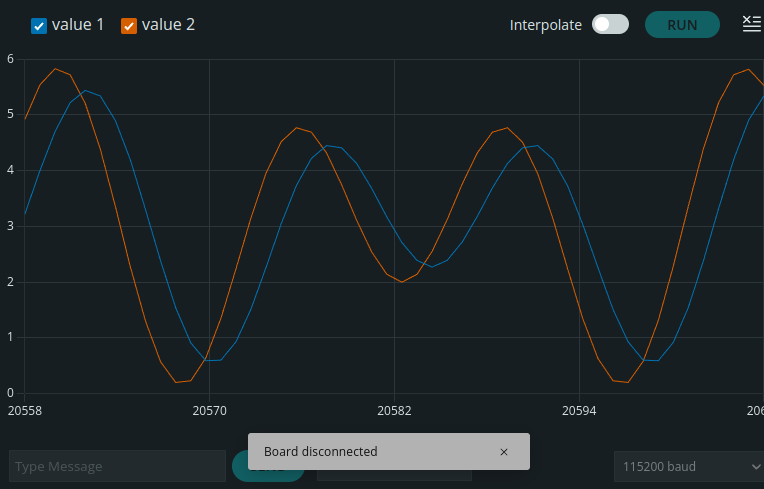
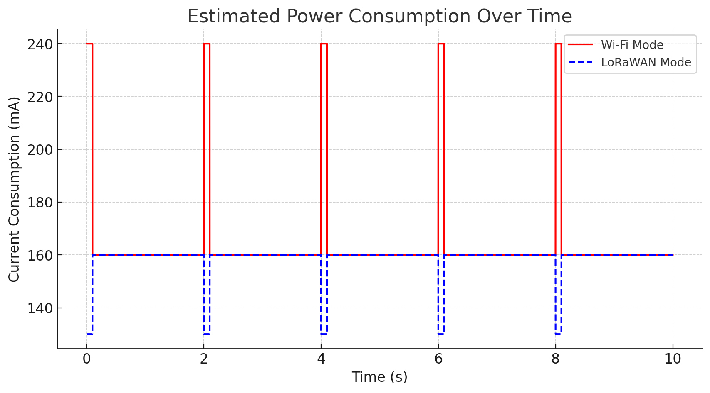

# Introduction

The goal of this assignment is to study and prove to build an IoT infrastructurev that is able to:
* Find the maximum sampling frequency of the esp32 board used 
* Generate a signal
* Sample the signal using the maximum frequency found and then adjust the sampling frequency through the help of the FFT
* Compute the average of the signal samples over a window
* Trasmit such results to an edge computer using wireless trasmission mediums 
* Measure a series of relevant metrics.

We will follow a step by step approach to show our work and our results.

# Setting up the environment

Our study requires a signal source to analyze, without it we cannot procede, so here we will show the technologies used and how the signal is locally generated, the signal we will generate ahs the following form: __2\*sin(2\*pi*3\*t)+4\*sin(2\*pi*5\*t)__.

The file `individual_assignment.ino` contains all the code of the project, in order to improve compilation efficiency and make the code cleaner and easier to use to someone who wants to test it, we have added some preprocessor directives.

These directive let you for example decide which kind of communication stack to use (either WiFi-MQTT or LoraWAN-TTN) by simply editing the MACRO `COMMUNICATION_METHOD`, set it to 1 for WiFi or 2 for LoraWAN.

There is another file called `sampling_frequency.ino` in which we do some tests to find the maximum sampling frequency the board is capable of and the best sampling frequency for the signal we generate.

# Finding the maximum sampling frequency


We want to find out which is the real maximum sampling frequency we can achieve using the ADC pin of our esp32 board, the sampling frequency is measured in Hz. 
The function _find\_max\_freq()_ is called in the _loop()_ so it is in a infinite loop where it reads a value from an analog pin enabled for ADC and increases a counter, after 1 second the counter is printed on the serial output and its value is reset to 0, giving us the number of samples taken in one seconds, hence the sampling frequency.
The output of this function is the following:

```
Sample Rate: 22032.00 Hz
```

We found out that the maximum sampling frequency is 22 kHz, this value seems low but not unexpected, from the datasheet the ADC pin of this board should be able to sample at maximum 100 kHz but here we are measuring this frequency in a very simple way, also there is a certain degree of overhead brought by the instructions, memory management, serial print etc. that slows down our function. 
This value however is very high for our purposes and we will show in the following section that is also too high.


# Identify optimal sampling frequency

We now know the maximum sampling frequency our board can achieve over the ADC pin (23 KHz), we will use this value to oversample the signal we generated, then thanks to the FFT function we will find the maximum frequency of the signal and adapt the sampling frequency to the double of such value, this will optimize the sampling by saving precious resources (energy,time,computational power etc.).

The function `signal_generation` generates our signal wave and using the FFT function provided by the arduinoFFT library finds the peak frequency of our signal.
We initially use as sampling frequency 22 kHz, this gives us as result a peak frequency of 8323.88Hz, this result is very strange, we know that the peak frequency of our signal is 5 Hz as we have generated it by ourselves.
Let's try to sample at 8300Hz, now the output is 
```
Peak Frequency: 3162.11 Hz
```
Still too high, we can try again and find as result 1200 Hz, so it lowers progessively but it is still too high compared to our expectations, let's try to sample at 100Hz.
In this case we get :

```
Peak Frequency: 5.01 Hz
```

Which is exactly what we expected, knowing this we can set the sampling frequency at 10Hz following the sampling theorem, to be sure we can set it to slightly larger value like 15 Hz.

The innaccuracies we found using the FFT function are probably related to how the library works and values of sampling frequency and singal frequecy too distant are not well handled by it.


# Generating the Signal Samples
We can now move to the `individual_assignment.ino` file to continue our study process.
Here we will change how we generate and sample the signal to better adapt this process to our study.

The process of generating signal samples is handled asynchronously within the `generate_signal_task`. This task simulates the creation of signal data by producing values and placing them into a queue. In this case, the task generates a simple signal pattern and sends each sample into the `samples_queue`. By using a dedicated task for signal generation, the system can continuously produce samples without blocking other operations, ensuring smooth real-time processing. The task communicates with the rest of the system through the queue, allowing for efficient data transfer between different processing steps.

# Sample the Signal Over a Sliding Window
To manage the incoming signal samples, the code employs a sliding window approach. The `sampling_signal_task` is responsible for receiving the generated signal samples from the `samples_queue`. As the signal samples arrive, they are stored in a circular buffer, and the task computes the average of the most recent samples to smooth out fluctuations. This task ensures that the system processes the data in manageable chunks and maintains an updated view of the signal’s characteristics. The sliding window technique ensures that only the most recent data is considered, keeping the computation efficient and relevant. The processed average is then passed through a separate queue, `transmission_queue`, for further handling.

We can show trough the ArduinoIDE Serial Plotter how much close our average sampling is to the actual signal:


Value 2 is the original signal and value 1 is the average computed, the plot shows clearly how close our smapling is to the original sin wave.

# Sending data

The application provides two communication methods for sending aggregated values: LoRa (via TTN) and MQTT (via Wi-Fi). The communication method used can be chosen based on the application configuration, ensuring flexibility in data transmission.

When the `sampling_signal_task` computes the aggregated signal value, such as the average frequency, it places the result into the `transmission_queue`. This value is then processed by the `avg_transmission_task`, which is responsible for sending the computed value to the chosen communication method, whether it's LoRa or MQTT. The task checks the current configuration via the `COMMUNICATION_METHOD` macro, determining whether to transmit via MQTT or LoRa.
# Sending the Aggregated Value to the MQTT Broker
We will send the aggregate value to our smartphone running mosquitto. The explanation on how to set up the mosquitto server on a Android device can be found above in the section **How to test**.

Once the aggregated signal value (such as the average frequency) is computed by the `sampling_signal_task`, it is passed through the `transmission_queue` to the `avg_transmission_task`. This task is responsible for taking the averaged result and sending it to an MQTT broker via the `send_over_wifi_mqtt` function. By separating the transmission logic into a dedicated task, the system ensures that the data is transmitted without interference from the data processing pipeline. The use of queues guarantees that values are sent in the correct order and without loss, providing reliable communication to external systems or clients. The asynchronous nature of the tasks and the queues allows for non-blocking, continuous operation even under high data loads.

# Sending data over LoRaWAN to TTN and a MQTT broker

We will send the aggregate value to TTN and the from TTN to a MQTT broker integrated with it, check __SETUP.md__ file to see how to configure the enviroment to test this.

The task `avg_transmission_task` checks the current communication method, and if LoRa is selected, it prepares the data for transmission and sends it via the `LoRaWAN.send()` function found in the `loop()` function that. This ensures that the data is sent to the TTN network in a reliable and structured way.
The system uses LoRaWAN’s low-power features, ensuring that the device sleeps between transmissions to conserve battery life, making it ideal for long-range, low-power applications.

In the file SETUP.md you can find how to connect to the MQTT server that is integrated with TTN in order to setup a mosquitto client to view this data.

# Energy Consumption (Qualitative) 

## Duty Cycle Estimation

The duty cycle refers to the percentage of time the device is actively performing tasks (like signal generation, sampling, or transmission) versus being in a low-power state (such as sleep mode). Understanding this cycle is crucial for estimating the device's energy efficiency.

For this project, the key tasks that affect the duty cycle are:

1. **Signal Generation Task**: This task runs continuously, updating the sine wave values. Since it uses a delay of 1 ms (`vTaskDelay(pdMS_TO_TICKS(1))`), it's essentially active 100% of the time.
  
2. **Signal Sampling and Averaging Task**: This task runs with a sampling period of about 67 ms (15 Hz). It processes samples, computes moving averages, and puts the results into a queue. Given that the task is busy for most of this period, it's also active 100% of the time.

3. **Transmission Task**: This task transmits data every 2 seconds. So, it’s only active about 5% of the time, based on the `2000 ms` delay. Transmission can happen over either Wi-Fi or LoRaWAN, but transmission durations are relatively short compared to the time spent idle.

   - **Wi-Fi transmission** typically draws more power than LoRaWAN due to the nature of Wi-Fi communication.
   - **LoRaWAN transmission**, while still power-hungry, is optimized for low power use and typically consumes less energy per transmission.

So, the overall duty cycle is quite heavily skewed towards signal generation and sampling, with transmission contributing only a small portion of the overall active time.


## Estimated Power Consumption

On average, the esp32 consumes about **160 mA** when running tasks like signal generation and sampling in active mode. When we start transmitting data, the power consumption spikes briefly during transmission.

We use 2 different transmission methods in this project resulting in 2 different expected values when evalueting energy consumption.

* __Wi-Fi__ transmission increases power consumption to approximately __220-250 mA__ during active communication
* __LoRaWAN__ transmission consumes around __120-140 mA__ during transmission, it implements a sleep cycle when not transmitting resulting in less energy consumption

Thus, assuming signal generation and sampling take up most of the time, and transmission occurs once every 2 seconds, the average current consumption could be estimated as:

* __Wi-Fi mode__ (transmitting 5% of the time):
    Average current ≈ 0.95×160 mA+0.05×240 mA=166 mA0.95×160mA+0.05×240mA=__166mA__

* __LoRaWAN mode__ (transmitting 5% of the time):
    Average current ≈ 0.95×160 mA+0.05×130 mA=157 mA0.95×160mA+0.05×130mA=__157mA__

We can plot the expected energy consumption over time like so:



# Latency

## WiFi

We want to compute the time it takes to our system to send data to the MQTT server, in order to do so we need to know the time at which a value has been sent and the time that value was received.  
In order to implement this we associate a timestamp with each value we send and using bash script we make mosquitto publish all the messages coming in topic angelo/signal to angelo/test.

```
mosquitto_sub -h "192.168.56.34" -t "angelo/signal" | while read line; do mosquitto_pub -h "192.168.56.34" -t "angelo/ack" -m "$line"      
pipe while> done
```
with this in our code setting the macro `TEST_LATENCY` to 1 we turn on the functionalities required to get the latency.

```
Round-trip latency: 237 ms
```

## LoRaWAN

Testing real world data about LoRaWAN latency is more difficult as it requires a close TTN gateway to get back data from the gateway. Unfortnuately at the time this section of project has been evaluated we did not have such gateway nearby so we provide in this section an estimation of what values we can expect.

Our project is designed and implemented to work with Class A LoRaWAN devices, as explained on the TTN website:

_Class A device can send an uplink message at any time. Once the uplink transmission is completed, the device opens two short receive windows for receiving downlink messages from the network. There is a delay between the end of the uplink transmission and the start of each receive window, known as RX1 Delay and RX2 Delay, respectively. If the network server does not respond during these two receive windows, the next downlink will be scheduled immediately after the next uplink transmission._

Source: https://www.thethingsnetwork.org/docs/lorawan/classes/#class-a

The latency in LoRaWAN communication depends on several factors, including the RX1 and RX2 delay, network server processing time, and the overall transmission conditions.

For Class A devices on The Things Network (TTN), the RX1 Delay is typically 1 second, while the RX2 Delay can vary but is commonly set to 2 seconds. This means that, under ideal conditions, a downlink message in response to an uplink could arrive with a minimum latency of 1 to 2 seconds.

However, real-world performance is influenced by additional delays, such as:

* Network processing time, which can introduce an extra 100–500 ms delay.

* Gateway backhaul delay, depending on internet latency, which can range from tens to hundreds of milliseconds.

* Possible retransmissions, if the first response is missed, increasing latency further.

Thus, in optimal conditions, the total round-trip time (uplink + network processing + downlink) is estimated to be 1.5 to 3 seconds. However, in cases with poor connectivity, congestion, or network-induced delays, the latency can exceed 5 seconds or more.