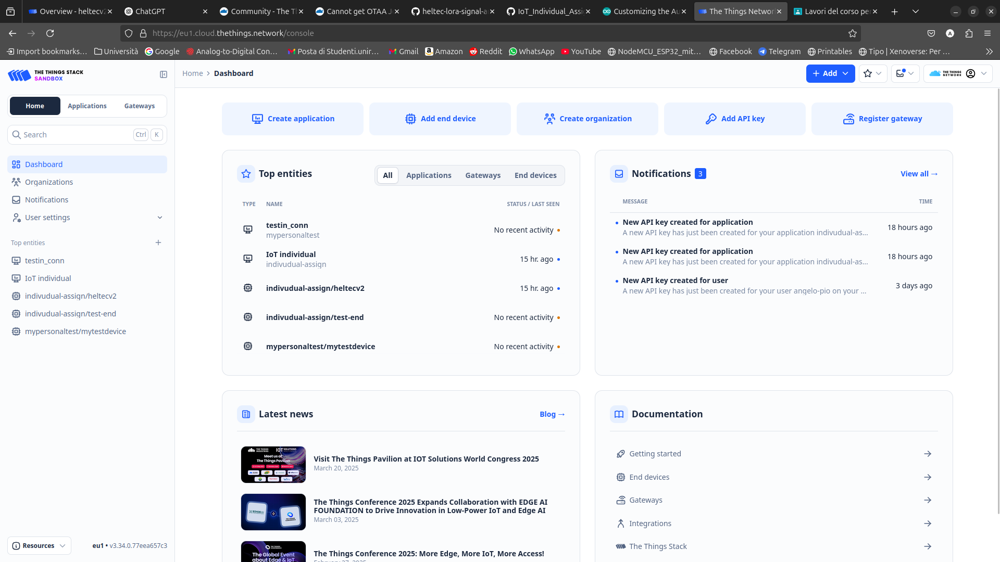
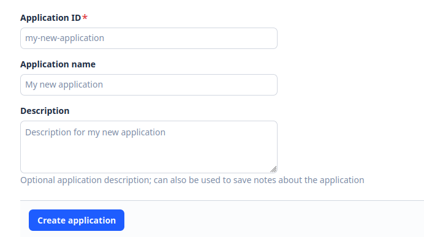
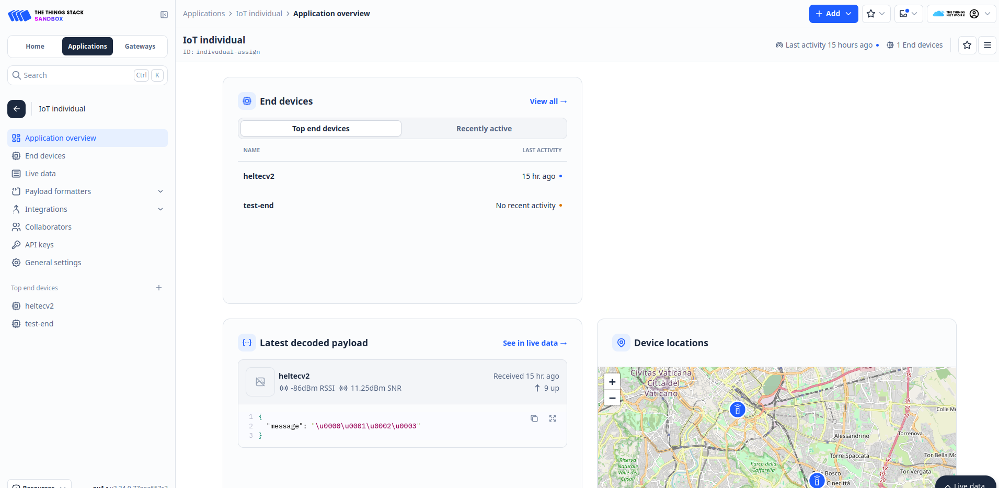
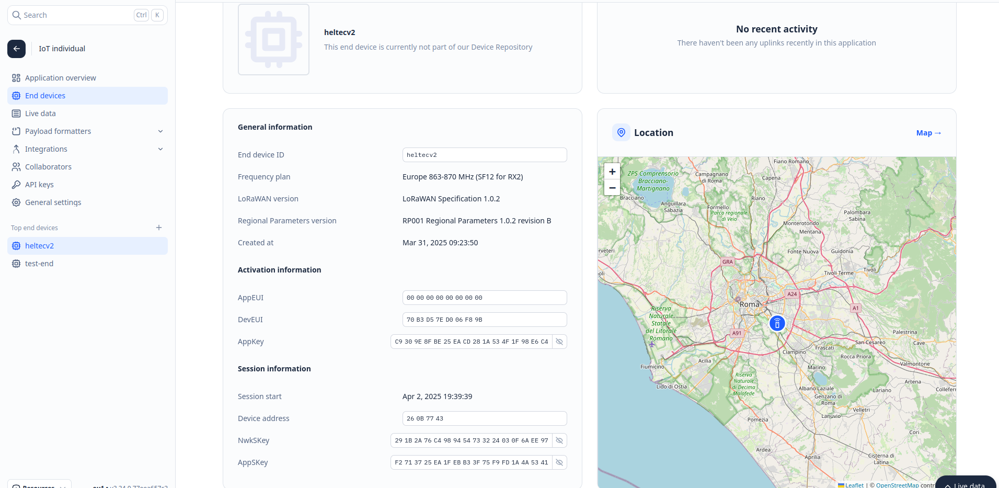
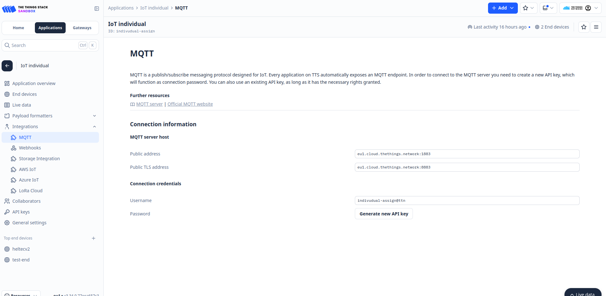

# SET UP 

The board used for this project is an Heltec esp 32 wifi Lora v2 module, we use ArduinoIDE as IDE to compile and upload code to the board.
Follow these steps in order to test this project: 

* Install ArduinoIDE on you machine 
* Clone the github repository on your machine 
```
git clone https://github.com/Angelo-Pio/IoT_Individual_Assignment
```
* Import the `individual_assignment.ino` file in ArduinoIDE
* Connect your esp32 board, select the serial port and board type used 
* Compile and upload the code to the board, before this step make sure to correctly set up the right environment, here below we explain how to do that based on what kind of communication method you want to test

# Send data over WiFI to a MQTT broker 
This section is dedicated to help you correctly configure the environment used to send data using wifi to a local hosted mqtt broker.
In this environment we use a smartphone as both an access point and a mqtt server to which publish data and subscribe to topics.  
## Configure WiFi connectivity

In the file `individual_assignment.ino`, you can find a section dedicated to WiFi configuration, you will find here two variables: ssid and password, set these variables in order to match the credentials of your smartphone hotspot.
This is required in order to use your smarphone as both the edge server and the WiFi source for the esp32 board.

## Configure the mosquitto server on an Android device

We will use our android smartphone to act as a edge server to which send messages through MQTT, the technology we will use is mosquitto, here we explain how to set up the Android device to run as a mosquitto server.

* Install termux on your Android device from the Play Store.
* Open termux and run the following commands
   ```
    pgk update
    pkg install mosquitto
    nano .mosquitto.conf
    ```
* add in the mosquitto.conf file the following
    ```
    allow_anonymous true
    bind_address 0.0.0.0
    ```
    This will make mosquitto not require authentication from the clients and enable it to receive connections that are not locally generated but come from the wifi connection
* run **ifconfig** to get the ip address of the smartphone and set such value in the variable `mqttServer`
* In the termux console run mosquitto to run mosquitto as a server
  ```
  mosquitto -c ".mosquitto.conf"
  ```

* Compile and upload the sketch on you board
* Open a terminal on your computer and subscribe to the topic specified in the variable `topic` in order to read the data sent to mosquitto using this commmand (replace the \<stubs\> with your values):
    ```
    mosquitto_sub -h "<mqttServer>" -t "<topic>" 
    ```

# Sending Data over LoRaWAN to TTN

In this section we explore how to set up our application to send data with LoRaWAN to TTN (The Things Network), also we explain how to integrate TTN with MQTT in order to publish the data send to TTN to a MQTT broker.

## Configuring the device on the Things Network

* Visit the page: https://www.thethingsnetwork.org/ and create an account
* In the top right corner select your account and then select _Console_, select network cluster: eu1 you will be redirected on the __main dashboard__

* From the top right corner_+ Add_\>_Add Application_ , here you will create your first application

* Insert an application id and a name, then click on _Create Application_
* From the dashboard click the menu _Applications_ here you will find your application, click on it 

*This is the __control panel__ of your application, from here you can create and manage you end devices, see what they sent to you etc. Let's create a new end device by click on _end devices + > Register end device_
* Follow instructions at https://docs.heltec.org/general/lorawan_abp/connect_to_lora_server.html to correctly connect your esp32 board
* You now will find you new end devices listed under End Devices, as shown in the previous image, click on your device to see all the device details.

Here you will find all the information we need to insert in the esp32 configuration. First set the location of your device using the map, then go aver the AppEUI section with your mouse, from here you can change the numberical representation of this value, change it to exadecimal and copy this value.
* In the folder that stores our code you can find a file named `LoRaWAN_TTN_conf.h`, here replace the value previously copied with the one contained in the appEui variable, it will look like this:

```
uint8_t appEui[] = { 0x00, 0x00, 0x00, 0x00, 0x00, 0x00, 0x00, 0x00 };
```

repeat this process for DevEUI and AppKey.
Now you have successfully connected the device to TTN.

## Integration with MQTT

* From the control panel of your application click on __Integrations>MQTT__

 here you can find the connection information need to integrate the mqtt server, you can find the detail on https://thethingsindustries.com/docs/integrations/mqtt
* Now open a terminal and type:
  ```
  mosquitto_sub -h <Public Address> -p "1883" -t "#" -u   "<username>" -P "<Password>" -d 
  ```
* You can now see all the data sent by the device to TTN and forwarded to the MQTT server
